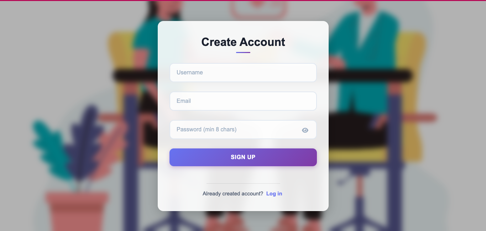
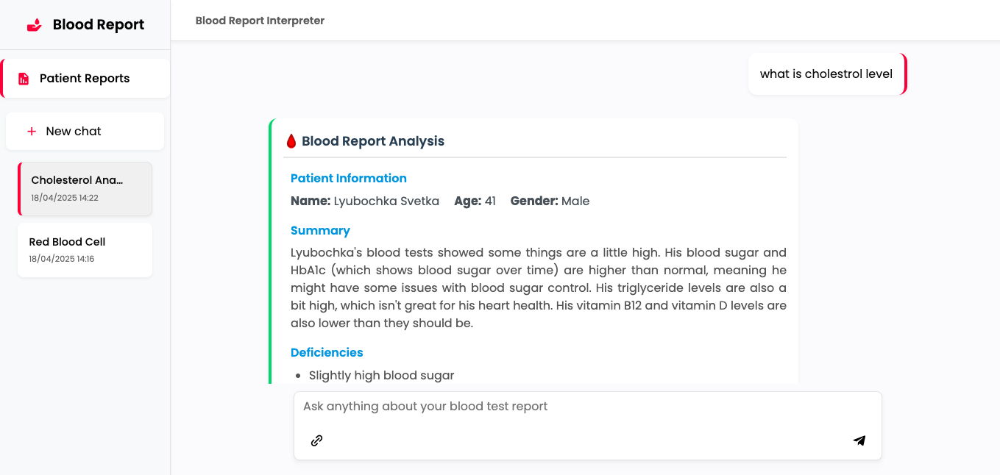
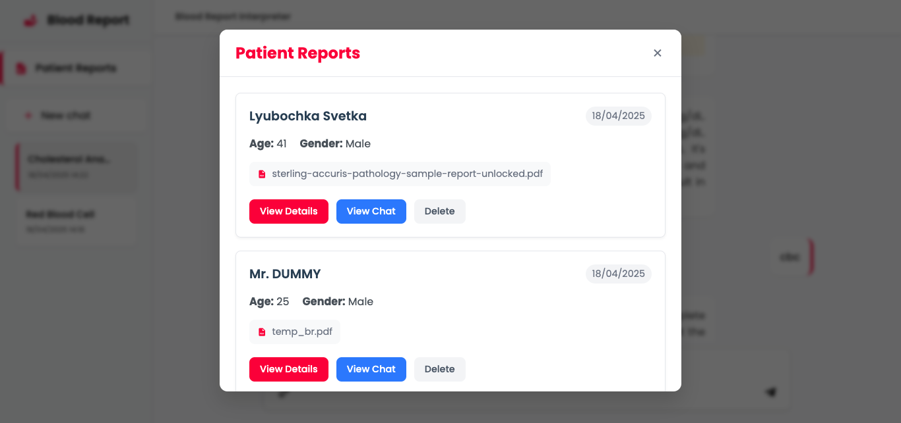

# Blood Report Interpreter

A web application that analyzes blood test reports (PDFs) using Google's Generative AI to extract key information, identify deficiencies, and provide personalized recommendations.





## Features

- **PDF Analysis**: Upload and analyze blood test reports
- **AI-Powered Insights**: Extract patient information, identify deficiencies, and get personalized recommendations
- **Chat Interface**: Discuss results with AI assistant and ask follow-up questions
- **User Authentication**: Secure login and signup functionality
- **Patient Reports**: Save and manage patient reports
- **Chat History**: Track conversations and access previous analyses

## Tech Stack

- **Backend**: FastAPI, Python 3.11+
- **Frontend**: HTML, CSS, JavaScript
- **Database**: MongoDB
- **AI**: Google Generative AI (Gemini 1.5 Flash)
- **PDF Processing**: PDFPlumber
- **Authentication**: Bcrypt, Session Middleware
- **Deployment**: Uvicorn

## Project Structure

```
app/
├── static/             # Static assets (CSS, JS, images)
│   ├── delete.png
│   ├── favicon.ico
│   ├── login_background.png
│   ├── remove.png
│   ├── script.js
│   ├── sidebar.css
│   └── styles.css
├── templates/          # HTML templates
│   ├── index.html      # Main application interface
│   └── login_page.html # Login/signup page
├── __init__.py
├── fixed_prompts.py    # AI prompts for blood report analysis
├── main.py             # Main application file
└── ...
```

## Prerequisites

- Python 3.11 or higher
- Poetry (Python package manager)
- MongoDB instance
- Google Generative AI API key

## Installation

1. **Clone the repository**

```bash
git clone https://github.com/yourusername/blood-scan-report.git
cd blood-scan-report
```

2. **Set up environment variables**

Create a `.env` file in the project root with the following:

```
GOOGLE_API_KEY=your_google_gemini_api_key
MONGODB_URI=your_mongodb_connection_string
```

3. **Install dependencies using Poetry**

```bash
poetry install
```

## Running the Application

```bash
poetry run python -m app.main
```

The application will automatically open in your default web browser at http://localhost:8000.

## Usage Guide

### 1. Authentication

- Sign up with a username, email, and password
- Log in with your credentials

### 2. Analyzing Blood Reports

- Upload a PDF blood test report
- The AI will analyze the report and display:
  - Patient information (name, age, gender)
  - Summary of key findings
  - List of detected deficiencies
  - Personalized recommendations

### 3. Chatting with the AI

- Ask follow-up questions about the analysis
- Inquire about specific deficiencies or recommendations
- Request additional information about test results

### 4. Managing Reports

- View all your patient reports in one place
- Access detailed analysis for each report
- Delete reports you no longer need

## API Endpoints

| Endpoint | Method | Description |
|----------|--------|-------------|
| `/` | GET | Home page (signup) |
| `/login` | GET | Login page |
| `/{username}/` | GET | User dashboard |
| `/{username}/{chat_id}` | GET | Specific chat page |
| `/api/signup` | POST | Create new user account |
| `/api/login` | POST | Authenticate user |
| `/` | POST | Upload and analyze PDF / Chat with AI |
| `/api/patient_reports/{username}` | GET | Get all patient reports |
| `/api/patient_report/{report_id}` | GET | Get specific patient report |
| `/api/patient_report/{report_id}` | DELETE | Delete patient report |
| `/api/chat_areas/{username}` | GET | Get all chat areas |
| `/api/chat_area/{chat_id}` | GET | Get specific chat area |
| `/api/chat_area/{chat_id}` | DELETE | Delete chat area |
| `/api/user_info` | GET | Get current user information |

## Development

This project uses Poetry for dependency management:

- Add a dependency: `poetry add package-name`
- Run with auto-reload: `poetry run uvicorn app.main:app --reload`
- Format code: `poetry run black .`
- Lint code: `poetry run flake8`

## Security Considerations

- Passwords are hashed using bcrypt
- Session management for authentication
- MongoDB connection uses TLS
- Input validation using Pydantic

## License

[MIT License](LICENSE)

## Acknowledgements

- Google Generative AI (Gemini) for the AI analysis capabilities
- FastAPI for the efficient API framework
- MongoDB for database storage
- All the open-source packages that made this project possible

---

For questions or support, please open an issue on the repository or contact the project maintainer.
